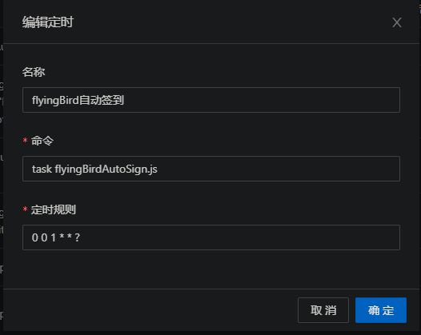

# dailyCheck

>自动青龙签到脚本

> aliyundriveDailyCheck.js为参考文件,来源[https://github.com/mrabit/aliyundriveDailyCheck](https://github.com/mrabit/aliyundriveDailyCheck)

## List

- [x] [flyingBird签到](#flyingbirddailycheck)

## flyingBirdDailyCheck.js

1. 脚本管理中新增脚本文件`flyingBirdAutoSign.js`
2. 环境变量中添加名称为`flyingBirdCookies`值为cookies的变量
3. 新建定时任务,命令为`task flyingBirdAutoSign.js`

